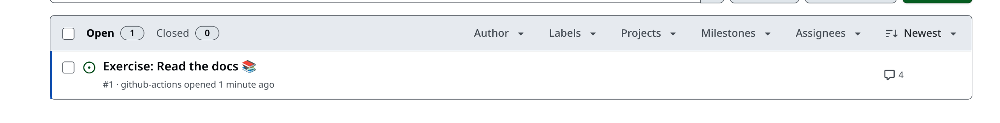
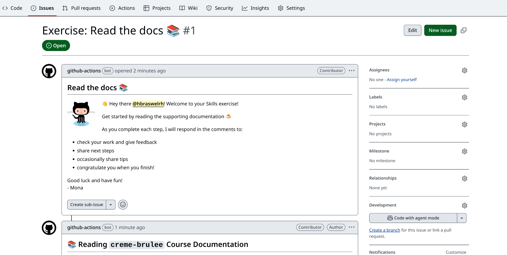

# Bite-sized ComplyTime 🍮

_Learn to use ComplyTime organization projects and tools._

## Welcome

- **Who is this for**: Compliance Managers, New ComplyTime users, Developers.
- **What you'll learn**: In this course, you'll learn how to set up the ComplyTime organization tools, author OSCAL Content from the GitHub UI, and leverage those tools for Compliance Management workflows.
- **What you'll build**: You'll initialize an oscal-content-demo workspace, interact with the ComplyTime organization codebases, and understand how ComplyTime tools assist in managing your Compliance Documentation through Agile Authoring and automated workflows.

### Prerequisites

#### GitHub 

- You'll need a GitHub account with a personal access token, setup [account here](https://github.com/), [token here](https://docs.github.com/en/authentication/keeping-your-account-and-data-secure/managing-your-personal-access-tokens) :octocat:

##### OSCAL for Compliance Managers

> Required before attempting the ComplyTime module of the learning course

- Review the OSCAL for Compliance Managers recording. The slides can be referenced [here](https://docs.google.com/presentation/d/13LDE-AL3xvWf1trSn_NE1OyjTP1KwVaq3HIbypgvtuU/edit?usp=sharing)

##### Required GitHub curated Skills courses to complete prior to the ComplyTime module 

> The required GitHub Skills courses will prepare you to interact with GitHub Issues, Pull Requests, and understand Git Flow. 

  - Take the [Introduction to GitHub](https://github.com/skills/introduction-to-github) Skills course. 
  - Take the [Communicate using Markdown](https://github.com/skills/communicate-using-markdown) GitHub Skills course. 

**Document your completion of these prerequisites [here](https://docs.google.com/forms/d/e/1FAIpQLScOfS4HjpbhMkbNqPCAUOnTdnZGHFNTQPemmMJkfH1_CH21Lw/viewform?usp=sharing&ouid=104913281648749089640)**

### :vertical_traffic_light: Start Here

  - Review the [GLOSSARY.md](https://github.com/hbraswelrh/creme-brulee/blob/main/docs/GLOSSARY.md) for relevant terms that will be used throughout course content. 
  - Refer to [GEMINI.md](https://github.com/hbraswelrh/creme-brulee/blob/8c2d9bf3d05eed5f00371fbb9f933839fe3556b4/docs/GEMINI.md) for prompts that could help with understanding the repository contents of [complyscribe](https://github.com/complytime/complyscribe/README.md), [complyctl](https://github.com/complytime/complyctl/README.md), and [ComplianceAsCode/content](https://github.com/ComplianceAsCode/content/blob/master/README.md).  
  - Review the [README.md](https://github.com/hbraswelrh/creme-brulee/blob/aae8325c6379d5dd97aa1de48f129c0cdd36aef4/.github/steps/README.md) outlining the course steps. 

> :hourglass: **How long?** This exercise is self-paced. The [manual_steps.md](https://github.com/hbraswelrh/creme-brulee/blob/e2574a94f9ac3f85a35d29749d326969d0faafbe/steps/manual_steps.md) can be leveraged to pace yourself and revisit subjects.

In this exercise, you will:
1. Learn about the relevant repositories in the ComplyTime organization.
2. Understand the relationship of the repositories and how the oscal-content-demo workspace mirrors the oscal-content repository. More info [here](https://github.com/hbraswelrh/creme-brulee/blob/e2574a94f9ac3f85a35d29749d326969d0faafbe/steps/manual_steps.md)
3. Trigger GitHub Actions that allow you to author OSCAL content. 
4. Practice using Git, Markdown, and ComplyTime tools. 

[//]: # (2. Make your own copy of an initialized oscal-content-demo workspace. More info [here]&#40;https://github.com/hbraswelrh/creme-brulee/blob/e2574a94f9ac3f85a35d29749d326969d0faafbe/steps/manual_steps.md&#41;) 

### How to start this exercise

Simply copy the exercise to your account, then give your favorite Octocat :octocat: **about 20 seconds** to prepare the first lesson, then **refresh the page**.

<!--  (replace-me: Make sure to edit the URL with proper template_owner, template_name, repo name and description)  -->

Having trouble? 🤷
 

Review the [manual_steps.md](https://github.com/hbraswelrh/creme-brulee/blob/e2574a94f9ac3f85a35d29749d326969d0faafbe/steps/manual_steps.md) and reach out in the Slack channel [#learn-complytime](https://redhat.enterprise.slack.com/archives/C093B45QGQM)
If the exercise isn't ready in 20 seconds, please check the [Actions](../../actions) tab.

- Check to see if a job is running. Sometimes it simply takes a bit longer.
- An issue should be opened that looks like this:

---

&copy; 2025 GitHub &bull; [Code of Conduct](https://www.contributor-covenant.org/version/2/1/code_of_conduct/code_of_conduct.md) &bull; [MIT License](https://gh.io/mit)
