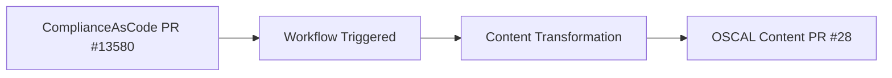
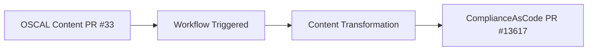
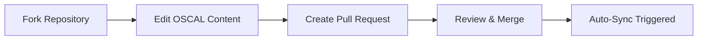

# 📚 OSCAL Content: Your Central Hub for Compliance

---

## 🌟 Overview

This repository is your **go-to place** for managing and storing security compliance content in the **Open Security Controls Assessment Language (OSCAL)** format. Our primary focus is on **Red Hat (RH)** products.

> 🎯 **Purpose**: Centralized hub for OSCAL compliance content management and synchronization

---

## 🚀 Automated Content Sync

Initialized by [**complyscribe**](https://github.com/complytime/complyscribe), this repository features powerful GitHub Actions designed for seamless content synchronization:

### 🔄 Sync Workflows

| Workflow             | Direction       | Purpose                                       | Source                                                                  |
|----------------------|-----------------|-----------------------------------------------|-------------------------------------------------------------------------|
| **`sync-comp`**      | ➡️ **Inbound**  | Generate OSCAL content from ComplianceAsCode  | [ComplianceAsCode/content](https://github.com/ComplianceAsCode/content) |
| **`sync-controls`**  | ➡️ **Inbound**  | Generate OSCAL controls from ComplianceAsCode | [ComplianceAsCode/content](https://github.com/ComplianceAsCode/content) |
| **`sync-oscal-cac`** | ⬅️ **Outbound** | Sync OSCAL updates back to ComplianceAsCode   | [ComplianceAsCode/content](https://github.com/ComplianceAsCode/content) |

### 🔄 Bidirectional Synchronization

> **`sync-oscal-cac`** and **`sync-cac-oscal`** create a powerful **two-way synchronization**, ensuring both projects stay updated with each other's content changes.

---

## ⚙️ How Content Synchronization Works

> ⚠️ **Development Status**: These CI systems are currently in active development. We're refining the user experience based on ongoing feedback.

### 📥 From ComplianceAsCode to OSCAL

**Workflow**: `sync-cac-oscal` transforms content from ComplianceAsCode/content into OSCAL format using the complyscribe CLI.

#### 🔄 Process Steps

| Step  | Action                 | Description                                                            |
|-------|------------------------|------------------------------------------------------------------------|
| **1** | 🔍 **Detect Changes**  | Identifies updates in source content (controls, profiles, rules, vars) |
| **2** | 🛠️ **Prepare**        | Gathers necessary arguments for Complyscribe                           |
| **3** | 🔄 **Transform**       | Runs complyscribe to convert source files into OSCAL                   |
| **4** | 📝 **Propose Updates** | Automatically creates a Pull Request with new OSCAL content            |

#### 📊 Real Example

**Live Example**: 
- ComplianceAsCode merge: [PR #13580](https://github.com/ComplianceAsCode/content/pull/13580)
- Triggered workflow: [Successful run](https://github.com/ComplianceAsCode/content/actions/runs/15688668981/job/44198205023)
- Generated OSCAL PR: [PR #28](https://github.com/ComplianceAsCode/oscal-content/pull/28)

---

### 📤 From OSCAL to ComplianceAsCode

**Workflow**: `sync-oscal-cac` handles reverse sync, reflecting OSCAL content updates back into ComplianceAsCode/content.

#### 🔄 Process Steps

| Step  | Action                        | Description                                                                |
|-------|-------------------------------|----------------------------------------------------------------------------|
| **1** | ⚡ **Trigger**                 | Activated upon merging PR with OSCAL file changes                          |
| **2** | 🔍 **Detect Updates**         | Identifies updated OSCAL files (catalogs, profiles, component-definitions) |
| **3** | 🔄 **Sync with ComplyScribe** | Transforms OSCAL updates back into standard formats                        |
| **4** | 📝 **Create Upstream PR**     | Automatically creates PR in ComplianceAsCode/content                       |

#### 📊 Real Example

**Live Example**:
- OSCAL content merge: [PR #33](https://github.com/ComplianceAsCode/oscal-content/pull/33)
- Triggered workflow: [Successful run](https://github.com/ComplianceAsCode/oscal-content/actions/runs/15841883094/job/44656004616)
- Generated ComplianceAsCode PR: [PR #13617](https://github.com/ComplianceAsCode/content/pull/13617)

---

## 🎥 Demo Recordings

### 📺 Watch the Workflows in Action

| Workflow             | Demo                                                                                    | Description                                      |
|----------------------|-----------------------------------------------------------------------------------------|--------------------------------------------------|
| **`sync-oscal-cac`** | [📹 Watch Demo](https://drive.google.com/file/d/1ZOc-H4f5zG_NCf_5rEuQMSwMZ52PkFzY/view) | OSCAL Content changes → ComplianceAsCode/content |
| **`sync-cac-oscal`** | [📹 Watch Demo](https://drive.google.com/file/d/1rvRlNkCzlvTh7NIC9JCKNIkiJCxW_S3W/view) | ComplianceAsCode/content changes → OSCAL Content |

---

## 🛠️ Tooling

We utilize [**ComplyScribe**](https://github.com/complytime/complyscribe) to help author and manage OSCAL content, ensuring adherence to required standards and formats.

### 🎯 Why ComplyScribe?

| Feature                    | Benefit                                   |
|----------------------------|-------------------------------------------|
| **📝 Content Authoring**   | Simplified OSCAL content creation         |
| **✅ Standards Compliance** | Ensures adherence to OSCAL specifications |
| **🔄 Format Management**   | Consistent content formatting             |
| **🤖 Automation Ready**    | Seamless CI/CD integration                |

---

## 🔍 Why Review `ComplianceAsCode/oscal-content`?

> 💡 **Key Insight**: The `ComplianceAsCode/oscal-content` repository is the **same concept** as your own `oscal-content-demo` repository.

### 🎯 Future Vision

**This repository will eventually be maintained by Compliance Managers**, providing:

- **📊 Centralized Content Management**: Single source of truth for OSCAL content
- **🔄 Automated Synchronization**: Seamless updates between systems
- **👥 Collaborative Workflows**: Team-based content authoring and review
- **📈 Scalable Architecture**: Growing with organizational needs

---

## 🤝 Contributing

### 🚀 How to Contribute

**Maintainers** can contribute by:

1. **🍴 Fork**: Create a fork of the repository
2. **✏️ Author/Edit**: Modify OSCAL content files
3. **📝 Pull Request**: Open a PR with your changes
4. **🔄 Auto-Sync**: Once merged, `sync-oscal-cac` workflow triggers automatically

### 📋 Contribution Workflow

---

### 🚀 Ready to Manage OSCAL Content?

**Transform your compliance workflow with automated OSCAL synchronization!**

---

> 🔄 **Automation**: Bidirectional sync ensures your compliance content stays consistent across all platforms!
